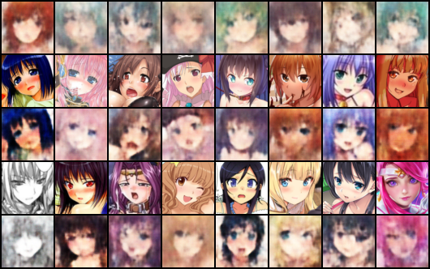
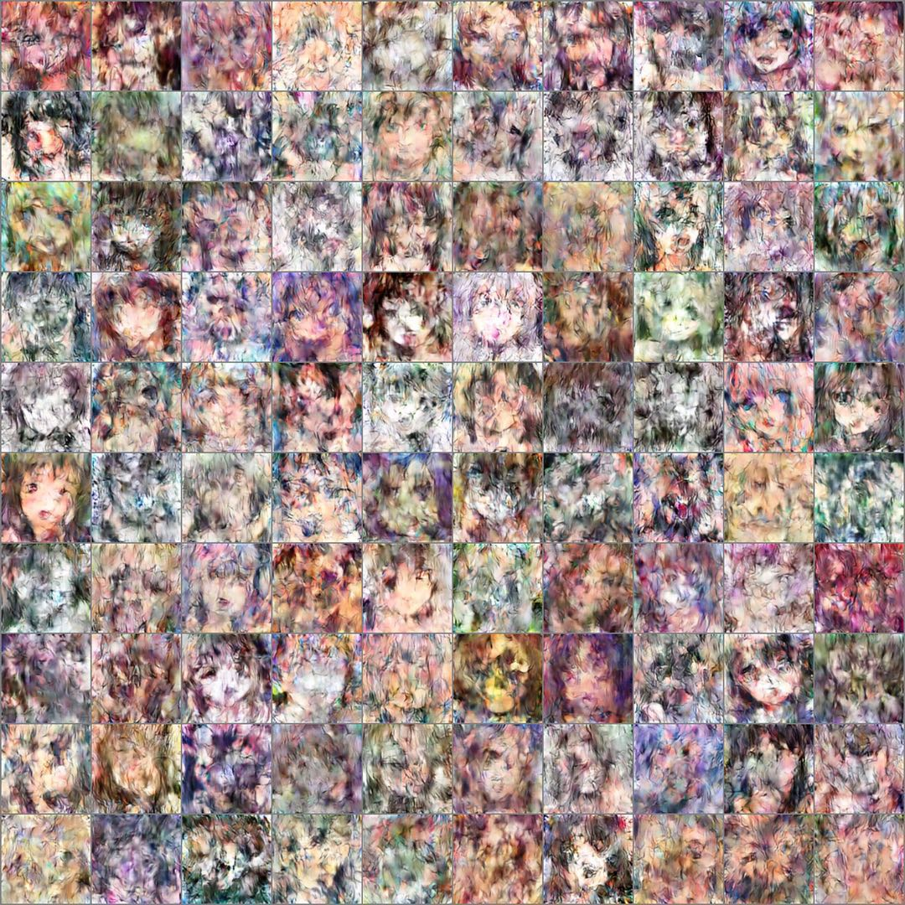
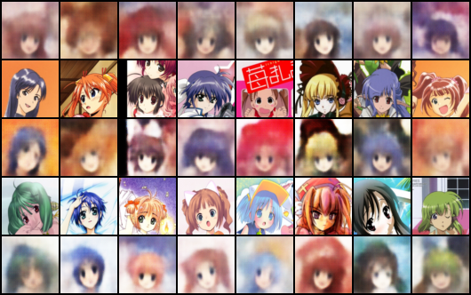
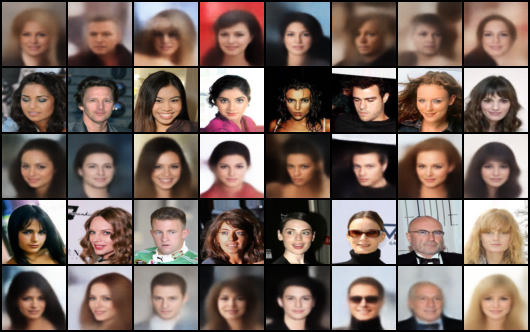

# README

Use variational autoencoder to generate some images

## Hentai

- Scraped 4k hentai images from [nsfw_data_scraper](https://github.com/alexkimxyz/nsfw_data_scraper)
- Faces obtained using [lbpcascade_animeface](https://github.com/nagadomi/lbpcascade_animeface)
- Interpretation of the result:
    - First row: randomly generated faces
    - Second row: images in the training set (95% of the data)
    - Third row: reconstruction of the training data
    - Fourth row: images in validation set (5% of the data)
    - Fifth row: reconstruction of the validation data

Below is the result generated by a completly failed VAE implementation, but I really love it!

## Anime Faces

- Dataset donwloaded from [here](http://www.nurs.or.jp/~nagadomi/animeface-character-dataset/), with 14404 anime face images

## CelebA

The CelebA dataset

